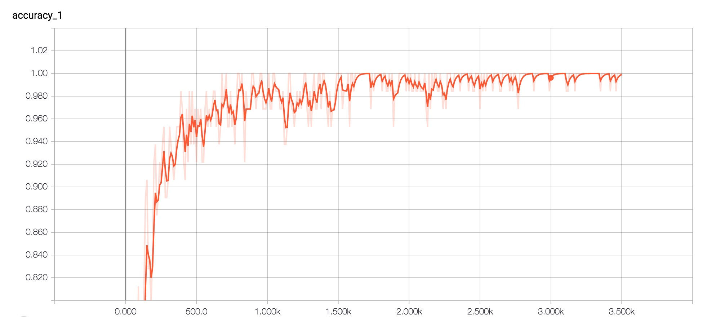
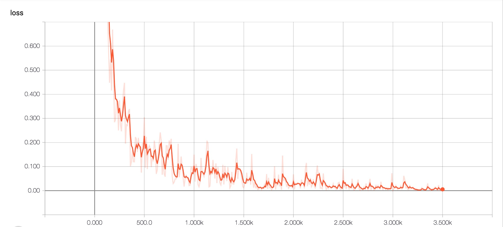
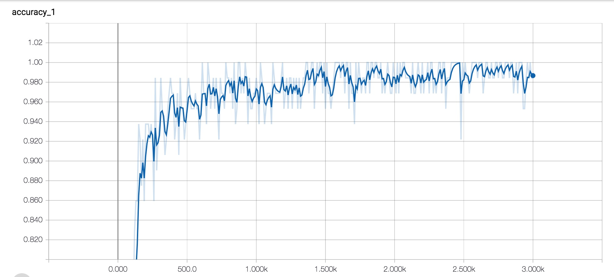
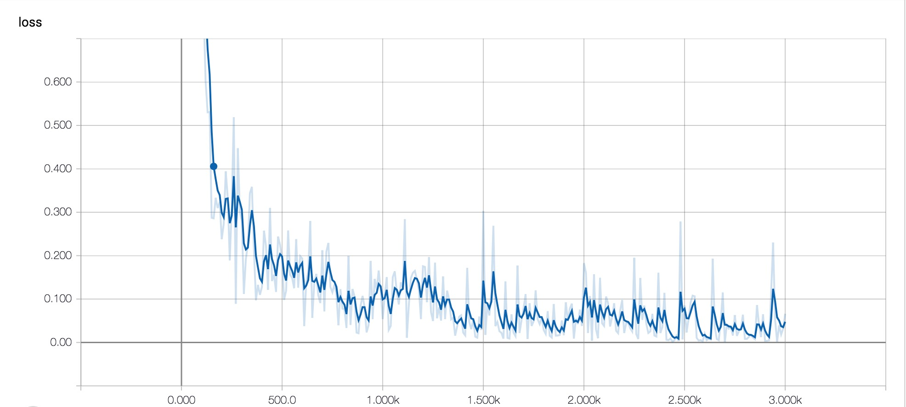

# Text Classification with CNN and RNN

使用卷积神经网络以及循环神经网络进行中文文本分类

该例子是fork [https://github.com/gaussic/text-classification-cnn-rnn](https://github.com/gaussic/text-classification-cnn-rnn)
优化并增加分词，过滤停用词等操作，CNN与RNN模型的性能都有提升, 在测试数据集中准确率分别是96.95%, 95.55%。

CNN做句子分类的论文可以参看: [Convolutional Neural Networks for Sentence Classification](https://arxiv.org/abs/1408.5882)

还可以去读dennybritz大牛的博客：[Implementing a CNN for Text Classification in TensorFlow](http://www.wildml.com/2015/12/implementing-a-cnn-for-text-classification-in-tensorflow/)

以及字符级CNN的论文：[Character-level Convolutional Networks for Text Classification](https://arxiv.org/abs/1509.01626)

本文是基于TensorFlow在中文数据集上的简化实现，使用了字符级CNN和RNN对中文文本进行分类，达到了较好的效果。

文中所使用的Conv1D与论文中有些不同，详细参考官方文档：[tf.nn.conv1d](https://www.tensorflow.org/api_docs/python/tf/nn/conv1d)

## 环境

- Python3
- TensorFlow 1.3以上
- numpy
- scikit-learn
- thulac

## 数据集

使用THUCNews的一个子集进行训练与测试，数据集请自行到[THUCTC：一个高效的中文文本分类工具包](http://thuctc.thunlp.org/)下载，请遵循数据提供方的开源协议。

本次训练使用了其中的10个分类，每个分类6500条数据。

类别如下：

```
体育, 财经, 房产, 家居, 教育, 科技, 时尚, 时政, 游戏, 娱乐
```

这个子集可以在此下载：链接: https://pan.baidu.com/s/1hugrfRu 密码: qfud

数据集划分如下：

- 训练集: 5000*10
- 验证集: 500*10
- 测试集: 1000*10

从原数据集生成子集的过程请参看`helper`下的两个脚本。其中，`copy_data.sh`用于从每个分类拷贝6500个文件，`cnews_group.py`用于将多个文件整合到一个文件中。执行该文件后，得到三个数据文件：

- cnews.train.txt: 训练集(50000条)
- cnews.val.txt: 验证集(5000条)
- cnews.test.txt: 测试集(10000条)

## 预处理

- `data/cnews_loader.py`为数据的预处理文件。
- `data/stopwords.txt`为停用词表文件。

- `read_file()`: 读取文件数据，并使用thulac对内容进行分词;
- `build_vocab()`: 构建词汇表，使用字符级的表示，这一函数会将词汇表存储下来，避免每一次重复处理;
- `read_vocab()`: 读取上一步存储的词汇表，转换为`{词：id}`表示;
- `read_category()`: 将分类目录固定，转换为`{类别: id}`表示;
- `to_words()`: 将一条由id表示的数据重新转换为文字;
- `process_file()`: 将数据集从文字转换为固定长度的id序列表示;
- `batch_iter()`: 为神经网络的训练准备经过shuffle的批次的数据。

经过数据预处理，数据的格式如下：

| Data | Shape | Data | Shape |
| :---------- | :---------- | :---------- | :---------- |
| x_train | [50000, 600] | y_train | [50000, 10] |
| x_val | [5000, 600] | y_val | [5000, 10] |
| x_test | [10000, 600] | y_test | [10000, 10] |

## CNN卷积神经网络

### 配置项

CNN可配置的参数如下所示，在`cnn_model.py`中。

```python
class TCNNConfig(object):
    """CNN配置参数"""

    vocab_size = 10000       # 词汇表大小
    seq_length = 600         # 序列长度

    embedding_dim = 64       # 词向量维度
    num_classes = 10         # 类别数

    num_filters = 256        # 卷积核数目
    kernel_size = 5          # 卷积核尺寸
    hidden_dim = 128         # 全连接层神经元

    dropout_keep_prob = 0.5  # dropout保留比例
    learning_rate = 1e-3     # 学习率

    batch_size = 64          # 每批训练大小
    num_epochs = 10          # 总迭代轮次

    print_per_batch = 100    # 每多少轮输出一次结果
    save_per_batch = 10      # 每多少轮存入tensorboard
```

### CNN模型

具体参看`cnn_model.py`的实现。

大致结构如下：


### 训练与验证

运行 `python run_cnn.py train`，可以开始训练。

> 若之前进行过训练，请把tensorboard/textcnn删除，避免TensorBoard多次训练结果重叠。

```
Training and evaluating...
Epoch: 1
Iter:        0, Train Loss:      2.2, Train Acc:   18.75%, Val Loss:      2.4, Val Acc:   10.00%, Time: 0:00:09 *
Iter:      100, Train Loss:      1.1, Train Acc:   73.44%, Val Loss:      1.1, Val Acc:   76.80%, Time: 0:01:18 *
Iter:      200, Train Loss:      0.2, Train Acc:   93.75%, Val Loss:     0.49, Val Acc:   85.70%, Time: 0:02:25 *
Iter:      300, Train Loss:     0.31, Train Acc:   92.19%, Val Loss:     0.31, Val Acc:   90.42%, Time: 0:03:34 *
Iter:      400, Train Loss:    0.092, Train Acc:   98.44%, Val Loss:     0.23, Val Acc:   92.38%, Time: 0:04:42 *
Iter:      500, Train Loss:     0.17, Train Acc:   96.88%, Val Loss:     0.23, Val Acc:   92.32%, Time: 0:05:55
Iter:      600, Train Loss:      0.1, Train Acc:   98.44%, Val Loss:     0.23, Val Acc:   92.66%, Time: 0:07:09 *
Iter:      700, Train Loss:    0.046, Train Acc:   98.44%, Val Loss:     0.17, Val Acc:   94.38%, Time: 0:08:21 *
Epoch: 2
Iter:      800, Train Loss:    0.022, Train Acc:  100.00%, Val Loss:     0.21, Val Acc:   93.40%, Time: 0:09:29
Iter:      900, Train Loss:    0.016, Train Acc:  100.00%, Val Loss:     0.22, Val Acc:   93.14%, Time: 0:10:37
Iter:     1000, Train Loss:    0.064, Train Acc:   98.44%, Val Loss:     0.22, Val Acc:   93.40%, Time: 0:11:45
Iter:     1100, Train Loss:    0.072, Train Acc:   95.31%, Val Loss:     0.18, Val Acc:   94.30%, Time: 0:12:53
Iter:     1200, Train Loss:    0.062, Train Acc:   98.44%, Val Loss:     0.16, Val Acc:   94.94%, Time: 0:14:02 *
Iter:     1300, Train Loss:   0.0084, Train Acc:  100.00%, Val Loss:      0.2, Val Acc:   94.12%, Time: 0:15:10
Iter:     1400, Train Loss:    0.012, Train Acc:  100.00%, Val Loss:     0.17, Val Acc:   94.80%, Time: 0:16:18
Iter:     1500, Train Loss:   0.0032, Train Acc:  100.00%, Val Loss:     0.15, Val Acc:   95.94%, Time: 0:17:27 *
Epoch: 3
Iter:     1600, Train Loss:    0.011, Train Acc:  100.00%, Val Loss:     0.17, Val Acc:   94.88%, Time: 0:18:35
Iter:     1700, Train Loss:   0.0045, Train Acc:  100.00%, Val Loss:     0.18, Val Acc:   94.70%, Time: 0:19:44
Iter:     1800, Train Loss:    0.007, Train Acc:  100.00%, Val Loss:     0.16, Val Acc:   95.10%, Time: 0:21:02
Iter:     1900, Train Loss:   0.0053, Train Acc:  100.00%, Val Loss:      0.2, Val Acc:   94.08%, Time: 0:22:19
Iter:     2000, Train Loss:     0.02, Train Acc:   98.44%, Val Loss:      0.2, Val Acc:   94.50%, Time: 0:23:34
Iter:     2100, Train Loss:    0.029, Train Acc:   98.44%, Val Loss:     0.21, Val Acc:   93.96%, Time: 0:24:49
Iter:     2200, Train Loss:    0.019, Train Acc:   98.44%, Val Loss:     0.14, Val Acc:   96.14%, Time: 0:26:03 *
Iter:     2300, Train Loss:    0.049, Train Acc:   98.44%, Val Loss:     0.14, Val Acc:   96.10%, Time: 0:27:19
Epoch: 4
Iter:     2400, Train Loss:    0.024, Train Acc:   98.44%, Val Loss:     0.15, Val Acc:   96.14%, Time: 0:28:34
Iter:     2500, Train Loss:    0.022, Train Acc:  100.00%, Val Loss:     0.14, Val Acc:   96.28%, Time: 0:29:50 *
Iter:     2600, Train Loss:   0.0026, Train Acc:  100.00%, Val Loss:     0.15, Val Acc:   96.00%, Time: 0:31:05
Iter:     2700, Train Loss:   0.0015, Train Acc:  100.00%, Val Loss:     0.18, Val Acc:   94.98%, Time: 0:32:21
Iter:     2800, Train Loss:   0.0043, Train Acc:  100.00%, Val Loss:     0.22, Val Acc:   94.48%, Time: 0:33:37
Iter:     2900, Train Loss:    0.003, Train Acc:  100.00%, Val Loss:     0.18, Val Acc:   95.46%, Time: 0:34:52
Iter:     3000, Train Loss:   0.0031, Train Acc:  100.00%, Val Loss:     0.18, Val Acc:   95.36%, Time: 0:36:07
Iter:     3100, Train Loss:  0.00094, Train Acc:  100.00%, Val Loss:     0.19, Val Acc:   95.28%, Time: 0:37:17
Epoch: 5
Iter:     3200, Train Loss:  0.00014, Train Acc:  100.00%, Val Loss:     0.25, Val Acc:   93.80%, Time: 0:38:31
Iter:     3300, Train Loss:    0.013, Train Acc:   98.44%, Val Loss:     0.19, Val Acc:   95.02%, Time: 0:39:49
Iter:     3400, Train Loss:  0.00056, Train Acc:  100.00%, Val Loss:     0.19, Val Acc:   95.78%, Time: 0:41:04
Iter:     3500, Train Loss:   0.0015, Train Acc:  100.00%, Val Loss:     0.18, Val Acc:   95.50%, Time: 0:42:19
No optimization for a long time, auto-stopping...
```

本次试验在验证集上准确率为96.28%。

准确率和误差如图所示：




### 测试

运行 `python run_cnn.py test` 在测试集上进行测试。

```
Testing...
Test Loss:     0.12, Test Acc:   96.95%
Precision, Recall and F1-Score...
             precision    recall  f1-score   support

         体育       1.00      1.00      1.00      1000
         财经       0.91      1.00      0.95      1000
         房产       0.99      0.99      0.99      1000
         家居       0.98      0.91      0.94      1000
         教育       0.96      0.93      0.94      1000
         科技       0.94      0.98      0.96      1000
         时尚       0.96      0.99      0.98      1000
         时政       0.97      0.95      0.96      1000
         游戏       0.98      0.97      0.97      1000
         娱乐       0.99      0.99      0.99      1000

avg / total       0.97      0.97      0.97     10000

Confusion Matrix...
[[999   0   0   1   0   0   0   0   0   0]
 [  0 997   1   0   0   0   0   2   0   0]
 [  0  11 986   0   0   0   1   2   0   0]
 [  0  41   1 907   9  11  15  10   4   2]
 [  1   8   1   4 926  31   8  10   8   3]
 [  1   1   0   4   4 982   2   1   4   1]
 [  0   0   0   2   1   2 990   1   0   4]
 [  0  22   2   0  12  11   1 951   1   0]
 [  0  11   0   0   8   5   8   0 967   1]
 [  0   1   0   3   3   1   1   1   0 990]]
Time usage: 0:00:37

```

在测试集上的准确率达到了96.95%，且各类的precision, recall和f1-score都超过了0.9。

从混淆矩阵也可以看出分类效果非常优秀。


### 训练几次CNN，在测试集上最好的成绩达到了97.51%
```
Training and evaluating...
Epoch: 1
Iter:        0, Train Loss:      2.3, Train Acc:   15.62%, Val Loss:      2.3, Val Acc:   10.00%, Time: 0:00:10 *
Iter:      100, Train Loss:     0.55, Train Acc:   87.50%, Val Loss:     0.81, Val Acc:   78.92%, Time: 0:01:18 *
Iter:      200, Train Loss:     0.22, Train Acc:   95.31%, Val Loss:      0.4, Val Acc:   87.78%, Time: 0:02:33 *
Iter:      300, Train Loss:     0.13, Train Acc:   96.88%, Val Loss:     0.22, Val Acc:   93.50%, Time: 0:03:52 *
Iter:      400, Train Loss:    0.082, Train Acc:   98.44%, Val Loss:     0.22, Val Acc:   93.06%, Time: 0:05:07
Iter:      500, Train Loss:    0.087, Train Acc:   96.88%, Val Loss:     0.18, Val Acc:   94.20%, Time: 0:06:18 *
Iter:      600, Train Loss:    0.081, Train Acc:   98.44%, Val Loss:     0.19, Val Acc:   93.40%, Time: 0:07:27
Iter:      700, Train Loss:    0.089, Train Acc:   96.88%, Val Loss:     0.16, Val Acc:   94.88%, Time: 0:08:36 *
Epoch: 2
Iter:      800, Train Loss:   0.0071, Train Acc:  100.00%, Val Loss:     0.14, Val Acc:   95.40%, Time: 0:09:44 *
Iter:      900, Train Loss:    0.041, Train Acc:   98.44%, Val Loss:     0.15, Val Acc:   95.54%, Time: 0:10:52 *
Iter:     1000, Train Loss:      0.2, Train Acc:   96.88%, Val Loss:     0.12, Val Acc:   96.14%, Time: 0:12:00 *
Iter:     1100, Train Loss:   0.0065, Train Acc:  100.00%, Val Loss:     0.17, Val Acc:   94.84%, Time: 0:13:08
Iter:     1200, Train Loss:    0.038, Train Acc:   98.44%, Val Loss:     0.16, Val Acc:   95.08%, Time: 0:14:16
Iter:     1300, Train Loss:    0.015, Train Acc:  100.00%, Val Loss:     0.15, Val Acc:   95.24%, Time: 0:15:23
Iter:     1400, Train Loss:   0.0037, Train Acc:  100.00%, Val Loss:     0.15, Val Acc:   95.26%, Time: 0:16:30
Iter:     1500, Train Loss:    0.033, Train Acc:   98.44%, Val Loss:     0.14, Val Acc:   96.02%, Time: 0:17:38
Epoch: 3
Iter:     1600, Train Loss:   0.0049, Train Acc:  100.00%, Val Loss:     0.16, Val Acc:   95.04%, Time: 0:18:47
Iter:     1700, Train Loss:   0.0041, Train Acc:  100.00%, Val Loss:     0.17, Val Acc:   95.10%, Time: 0:19:56
Iter:     1800, Train Loss:    0.028, Train Acc:   98.44%, Val Loss:     0.17, Val Acc:   95.06%, Time: 0:21:05
Iter:     1900, Train Loss:   0.0024, Train Acc:  100.00%, Val Loss:     0.19, Val Acc:   94.80%, Time: 0:22:13
Iter:     2000, Train Loss:  0.00066, Train Acc:  100.00%, Val Loss:     0.18, Val Acc:   94.70%, Time: 0:23:22
No optimization for a long time, auto-stopping...

本次试验在验证集上准确率为96.14%， 在测试集上准确率为97.51%。
Testing...
Test Loss:    0.081, Test Acc:   97.51%
Precision, Recall and F1-Score...
             precision    recall  f1-score   support

         体育       1.00      1.00      1.00      1000
         财经       0.98      0.99      0.99      1000
         房产       0.99      0.99      0.99      1000
         家居       0.97      0.93      0.95      1000
         教育       0.95      0.94      0.94      1000
         科技       0.98      0.98      0.98      1000
         时尚       0.97      0.99      0.98      1000
         时政       0.96      0.96      0.96      1000
         游戏       0.97      0.98      0.98      1000
         娱乐       0.99      0.98      0.99      1000

avg / total       0.98      0.98      0.98     10000

Confusion Matrix...
[[999   0   0   1   0   0   0   0   0   0]
 [  0 992   1   0   1   0   0   6   0   0]
 [  0   0 990   5   1   0   0   3   1   0]
 [  0  13   2 926  14   2  23  14   5   1]
 [  1   2   0   4 943  12   3  16  17   2]
 [  0   0   0   1   3 983   4   2   7   0]
 [  0   0   0   4   2   2 988   1   0   3]
 [  0   5   2   7  18   3   1 963   1   0]
 [  0   1   0   2   8   3   2   0 984   0]
 [  0   0   0   5   6   2   1   1   2 983]]
Time usage: 0:00:43

```


## RNN循环神经网络

### 配置项

RNN可配置的参数如下所示，在`rnn_model.py`中。

```python
class TRNNConfig(object):
    """RNN配置参数"""

    vocab_size = 10000       # 词汇表大小
    seq_length = 600         # 序列长度

    embedding_dim = 64       # 词向量维度
    num_classes = 10         # 类别数

    num_layers = 2           # 隐藏层层数
    hidden_dim = 128         # 隐藏层神经元
    cell = 'gru'             # lstm 或 gru

    dropout_keep_prob = 0.8  # dropout保留比例
    learning_rate = 1e-3     # 学习率

    batch_size = 64          # 每批训练大小
    num_epochs = 10          # 总迭代轮次

    print_per_batch = 100    # 每多少轮输出一次结果
    save_per_batch = 10      # 每多少轮存入tensorboard
```

### RNN模型

具体参看`rnn_model.py`的实现。

大致结构如下：


### 训练与验证

> 这部分的代码与 run_cnn.py极为相似，只需要将模型和部分目录稍微修改。

运行 `python run_rnn.py train`，可以开始训练。

> 若之前进行过训练，请把tensorboard/textrnn删除，避免TensorBoard多次训练结果重叠。

```
Training and evaluating...
Epoch: 1
Iter:        0, Train Loss:      2.3, Train Acc:    7.81%, Val Loss:      2.3, Val Acc:   10.00%, Time: 0:00:53 *
Iter:      100, Train Loss:     0.78, Train Acc:   78.12%, Val Loss:     0.96, Val Acc:   68.86%, Time: 0:05:06 *
Iter:      200, Train Loss:      0.2, Train Acc:   95.31%, Val Loss:     0.46, Val Acc:   85.70%, Time: 0:09:19 *
Iter:      300, Train Loss:     0.24, Train Acc:   95.31%, Val Loss:     0.35, Val Acc:   88.84%, Time: 0:13:19 *
Iter:      400, Train Loss:     0.11, Train Acc:   95.31%, Val Loss:     0.35, Val Acc:   89.88%, Time: 0:17:16 *
Iter:      500, Train Loss:     0.17, Train Acc:   96.88%, Val Loss:     0.49, Val Acc:   86.10%, Time: 0:21:17
Iter:      600, Train Loss:     0.17, Train Acc:   95.31%, Val Loss:     0.36, Val Acc:   90.20%, Time: 0:25:26 *
Iter:      700, Train Loss:     0.21, Train Acc:   95.31%, Val Loss:     0.38, Val Acc:   89.50%, Time: 0:29:37
Epoch: 2
Iter:      800, Train Loss:    0.064, Train Acc:   98.44%, Val Loss:     0.31, Val Acc:   91.22%, Time: 0:33:30 *
Iter:      900, Train Loss:      0.1, Train Acc:   96.88%, Val Loss:     0.34, Val Acc:   90.18%, Time: 0:38:30
Iter:     1000, Train Loss:    0.052, Train Acc:   98.44%, Val Loss:     0.33, Val Acc:   90.56%, Time: 0:43:27
Iter:     1100, Train Loss:     0.12, Train Acc:   96.88%, Val Loss:     0.36, Val Acc:   89.96%, Time: 0:47:20
Iter:     1200, Train Loss:     0.16, Train Acc:   95.31%, Val Loss:      0.4, Val Acc:   88.10%, Time: 0:50:53
Iter:     1300, Train Loss:     0.12, Train Acc:   95.31%, Val Loss:      0.4, Val Acc:   88.20%, Time: 0:54:21
Iter:     1400, Train Loss:    0.016, Train Acc:  100.00%, Val Loss:     0.41, Val Acc:   88.60%, Time: 0:57:53

Iter:     1500, Train Loss:     0.29, Train Acc:   95.31%, Val Loss:     0.33, Val Acc:   90.92%, Time: 1:01:18
Epoch: 3
Iter:     1600, Train Loss:   0.0076, Train Acc:  100.00%, Val Loss:     0.36, Val Acc:   90.94%, Time: 1:04:42
Iter:     1700, Train Loss:    0.072, Train Acc:   96.88%, Val Loss:     0.29, Val Acc:   92.08%, Time: 1:08:20 *
Iter:     1800, Train Loss:    0.014, Train Acc:  100.00%, Val Loss:     0.41, Val Acc:   89.32%, Time: 1:12:03
Iter:     1900, Train Loss:    0.015, Train Acc:  100.00%, Val Loss:     0.34, Val Acc:   91.46%, Time: 1:15:52
Iter:     2000, Train Loss:     0.17, Train Acc:   98.44%, Val Loss:      0.3, Val Acc:   92.10%, Time: 1:19:33 *
Iter:     2100, Train Loss:    0.027, Train Acc:   98.44%, Val Loss:     0.31, Val Acc:   91.84%, Time: 1:23:21
Iter:     2200, Train Loss:    0.022, Train Acc:  100.00%, Val Loss:      0.4, Val Acc:   89.98%, Time: 1:26:55
Iter:     2300, Train Loss:    0.078, Train Acc:   96.88%, Val Loss:     0.28, Val Acc:   91.88%, Time: 1:30:28
Epoch: 4
Iter:     2400, Train Loss:      0.1, Train Acc:   98.44%, Val Loss:     0.31, Val Acc:   92.04%, Time: 1:34:31
Iter:     2500, Train Loss:    0.064, Train Acc:   98.44%, Val Loss:     0.45, Val Acc:   89.44%, Time: 1:38:29
Iter:     2600, Train Loss:   0.0093, Train Acc:  100.00%, Val Loss:     0.36, Val Acc:   91.46%, Time: 1:42:32
Iter:     2700, Train Loss:  0.00044, Train Acc:  100.00%, Val Loss:     0.34, Val Acc:   91.66%, Time: 1:46:22
Iter:     2800, Train Loss:   0.0049, Train Acc:  100.00%, Val Loss:     0.35, Val Acc:   91.82%, Time: 1:50:33
Iter:     2900, Train Loss:   0.0029, Train Acc:  100.00%, Val Loss:     0.44, Val Acc:   90.20%, Time: 1:54:51
Iter:     3000, Train Loss:    0.058, Train Acc:   98.44%, Val Loss:     0.38, Val Acc:   91.62%, Time: 1:58:56
No optimization for a long time, auto-stopping...
```

本次试验在验证集上准确率为92.10%。

准确率和误差如图所示：





### 测试

运行 `python run_rnn.py test` 在测试集上进行测试。

```
Testing...
Test Loss:     0.17, Test Acc:   95.55%
Precision, Recall and F1-Score...
             precision    recall  f1-score   support

         体育       1.00      0.98      0.99      1000
         财经       0.95      0.99      0.97      1000
         房产       0.99      1.00      0.99      1000
         家居       0.96      0.83      0.89      1000
         教育       0.93      0.90      0.91      1000
         科技       0.92      0.98      0.95      1000
         时尚       0.95      0.97      0.96      1000
         时政       0.93      0.97      0.95      1000
         游戏       0.96      0.96      0.96      1000
         娱乐       0.99      0.97      0.98      1000

avg / total       0.96      0.96      0.96     10000

Confusion Matrix...
[[983   0   0   0   0  13   0   4   0   0]
 [  0 994   1   1   0   1   0   3   0   0]
 [  0   1 996   2   1   0   0   0   0   0]
 [  0  36  11 831  27  11  38  37   6   3]
 [  0   5   1   6 898  32   3  20  30   5]
 [  0   1   0   5   8 978   3   0   4   1]
 [  0   2   0  14   2   4 973   0   0   5]
 [  0   9   0   0   7   8   0 973   3   0]
 [  0   0   0   2  20  14   5   3 956   0]
 [  1   1   0   3   6   7   3   6   0 973]]
Time usage: 0:02:23

```

在测试集上的准确率达到了95.55%，且各类的precision, recall和f1-score，除了家居这一类别，都超过了0.9。

从混淆矩阵可以看出分类效果非常优秀。

对比两个模型，可见RNN除了在家居分类的表现不是很理想，其他几个类别较CNN差别不大。

还可以通过进一步的调节参数，来达到更好的效果。


## 预测

为方便预测，repo 中 `predict.py` 提供了 CNN 模型的预测方法。
